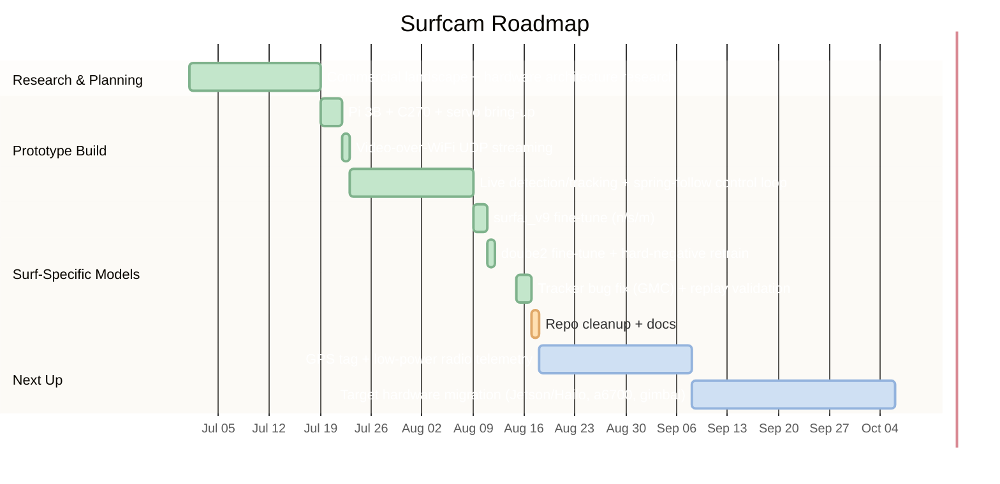

# Surfcam

Open-source, autonomous pan-tilt camera rig that detects and tracks a surfer in the water, so you can film a session hands-free.

<!-- Hero image/GIF/demo link goes here once there's a clip worth leading with - a media/detection_videos clip is a good candidate. -->

## Overview

<!-- What problem this solves, who it's for, and why it exists. 2-4 sentences. -->
STATUS: Currently in a proof-of-concept stage, I'm working on making sure all components of this project broadly work together before committing to more expensive components time-wise and finance-wise. Currently, the current setup does a great job of tracking a person visually at ~10m range in low resolution and no physical zoom, and following them smoothly given the servos available. The next step will be integrating a GPS tag on the target + Low power radio communication between the tag and base station, to allow for a more precise aiming system besides pure computer-vision.

Surfcam is my project with the goal of creating an open-source, autonomous activity tracking setup for surfers to leave alone on the beach while they go about catching waves. I aim to address certain reported issues with existing surf tracking solutions, such as the SoloShot3 (link needed), as well as provide people the means to recreate the project on their own with their own cameras. Existing products on the market, such as the SoloShot3, have had issues with GPS location drifting and annoying calibration, which I believe can be avoided in this case.

## Features

- Real-time person detection via YOLO26 computer vision
- Confidence floor + N-frame hold streak to filter out one-off false positives (birds, spray, glare) before locking onto a target
- Automatic target selection
- Spring-follow pan/tilt control for damped, low-jitter aiming instead of direct proportional/PID control
- Pi-side servo command interpolation (50Hz slew-rate loop) for smooth continuous motion between UDP updates
- Split-machine architecture over raw UDP: Pi handles capture + servo drive, desktop/laptop handles detection/tracking/control
- Debug overlay window (bounding boxes, target crosshair, track ID/confidence) for visualizing detection and tracking live
- Multi-frame tracking with BoT-SORT (`persist=True`) so a person (surfer in the future) keeps the same ID across frames instead of being re-detected each time

<!-- Screenshots, GIFs, or embedded/linked video of detection + tracking in action. -->

## How It Works

The current prototype loop is split across two machines: a Raspberry Pi 3B on the tripod, and a desktop/laptop doing the CV computation and calculating servo movements
- Video Capture -> Detect & Track -> Pick Target -> Aim -> Execute Movement -> Repeat
1. **Video Capture.** The Pi grabs frames from a Logitech C270 webcam, JPEG-encodes them, and pushes them over WiFi via raw UDP. Capture and send run on separate threads on the Pi so a slow encode never blocks the next frame grab. On the laptop version of the script, the webcam is connected directly to the laptop, eliminating the streaming over wifi aspect and reducing latency by about 150-200ms.
2. **Detect.** The desktop decodes the stream and runs a YOLO26 model over each frame, currently only using the generic COCO-pretrained (`person` class). However, a surf-specific fine-tuned (`surfai_v9`, `doube2`, trained on harvested surf footage) arer WIP but aren't finished or tested in real surf conditions yet.
3. **Track.** Detections are fed through BoT-SORT (Bag of Tricks),  (`model.track(persist=True)`) so the same surfer keeps the same track ID frame to frame instead of being re-detected from scratch. On the laptop version of the script, persistence is toggled off to save compute power and increase FPS. This may change in the future. A confidence floor plus an N-frame hold streak determines which detected objects are eligible to be locked onto, filtering out one-off flicker false positives (birds, spray, glare).
4. **Pick a target.** Among eligible tracked objects, the largest bounding box is chosen, a temporary alternative to "closest/most prominent surfer in frame" or determining a specific surfer with GPS.
5. **Aim.** The target's pixel offset from the center of the frame converts to a pan/tilt angle delta, then runs through a spring-follow controller instead of direct proportional control, which damps overshoot and reduuces jitter by not snapping straight to the target. Max angular speed per axis is capped by a tunable sigmoid speed curve, so the servo eases in near center and hits full speed toward the frame edge.
6. **Execute Movement.** Pan/tilt angle commands go back to the Pi as a fixed 8-byte UDP payload (two floats, no header), where the Pi drives the SG90 pan-tilt servos, clamped to a safe angle range.

This is the prototype/proof-of-concept loop, built to validate detection/tracking/control on cheaper hardware and what I have on-hand before committing to the target build.

## Tech Stack

**Detection & tracking**
- Using [Ultralytics](https://github.com/ultralytics) YOLO26 for detection, `yolo26n.pt` is the current default, with older YOLOv8 checkpoints and `yolo26s.pt`, `yolo26m.pt`, the small and medium versions kept alongside for A/B comparison
- BoT-SORT for multi-frame tracking (`model.track(persist=True)`), run with global motion compensation disabled (improved performance from ~10 to ~16 fps)
- OpenCV (`cv2`) for capture, JPEG encode/decode, and the debug overlay window

**Control**
- A spring-follow controller (critically-damped step) instead of a PID loop, converting pixel offset into pan/tilt angle
- (Phased out) A closed-form logistic-sigmoid speed-cap curve (`speed_curve.py`), live-tunable via an OpenCV trackbar UI, saved to `tracking_tuning.json`
- Pi-side command interpolation - a fixed 50Hz slew-rate loop smooths the servo's discrete, lower-rate UDP updates into continuous motion instead of visibly stepping

**Networking**
- Raw UDP sockets (Python `socket`/`struct`) for both the video stream and servo commands
- Servo commands are a fixed 8-byte payload (two big-endian float32s) with no headers
- Threaded producer/consumer split on both ends (capture vs. encode+send on the Pi; receive vs. detect+track on the desktop/laptop)

**Dataset & training tooling**
- Roboflow for dataset hosting/annotation;
- `ultralytics`'s training API for fine-tuning the surf-specific model lineages (`surfai_v9`, `doube2`)

**Platform**
- Python end-to-end - Windows desktop (CUDA GPU for inference) and Raspberry Pi OS
- `pygrabber` for DirectShow webcam enumeration on the Windows side

## Hardware

**Prototype (current)**
- Raspberry Pi 3B with full-size USB, built-in WiFi; streams video and drives servos directly
- Logitech C270 webcam - 720p/30fps, USB, 60 degree FOV
- SG90 micro servo (tilt) + MG90 micro servo (pan) (MG90 has metal gears)
- ThtRht nylon anti-vibration pan-tilt bracket, webcam mounted via hot glue (amazon link needed)
- Servos wired to Pi GPIO with hardware PWM (`rpi_hardware_pwm`): pan on GPIO 17, tilt on GPIO 27 for later reference
- Wired servos into an extension cord for field power (need to check if they can draw power directly from thhe pi)
- Windows desktop/laptop with a CUDA GPU does all inference for the system wirelessly

**Target build**
- Compute: Jetson Orin Nano, or a Raspberry Pi 5 + Hailo-8L, currently the cost/power favorite, see [research.md](research.md#prototype-findings--full-scale-deployment-considerations-july-2026)
- Camera: Sony a6700 (26MP APS-C, 759-point phase-detect AF, 4K/60p) controlled over USB via Sony's Camera Remote SDK, paired with a Sony E 70-350mm f/4.5-6.3 G OSS lens (This is what Nathan owns)
- Pan-tilt: brushless gimbal motors with encoder feedback and closed-loop position control [DigitalBird3 4 Axis pan-tilt kit](https://digital-bird-motion-control.myshopify.com/products/db3-wifi-visca-pan-tilt-head)
- Power: ~100Wh LiFePO4 battery, targeting 4-5hr of unattended runtime

## Model & Training

All fine-tunes start from Ultralytics' pretrained YOLO26 checkpoints (`n`/`s`/`m`) and are trained 50 epochs at `imgsz=640` via `ultralytics`'s training API, with Roboflow-hosted datasets. `doube2_yolo26s.pt` is the current production weight and was additionally passed through a hard-negative mining round (retrained against false-positive crops pulled from real footage) to cut down on false triggers; its backup pre-hardneg weight is kept alongside as `doube2_yolo26s_PRE_hardneg_backup.pt`.

The latest model does well with detecting and tracking surfers on a wave, but most noticebly struggles when too many objects are in frame, i.e. 100 surfers waiting for a wave, all in frame at once. This shouldn't be an issue when GPS is implemented, allowing for a rough reduction in FOV when the camera zooms in to the approximate location of the tagged surfer.

| Model | Classes | Dataset (train / val images) | Precision | Recall | mAP50 | mAP50-95 |
|---|---|---|---|---|---|---|
| `surfai_v9_yolo26n` | 2 (`surfer`, `Surfer_Riding`) | Surfer-Detection-9 (317 / 90) | 80.9% | 72.6% | 81.9% | 37.0% |
| `surfai_v9_yolo26s` | 2 (`surfer`, `Surfer_Riding`) | Surfer-Detection-9 (317 / 90) | 75.1% | 93.3% | 91.3% | 41.9% |
| `surfai_v9_yolo26m` | 2 (`surfer`, `Surfer_Riding`) | Surfer-Detection-9 (317 / 90) | 80.3% | 79.9% | 83.6% | 41.4% |
| `doube2_yolo26n` | 7 (surfer, surfer_ride, wave + 4 wave-state classes) | surfer_doube2_full (5672 / 1412) | 91.5% | 87.5% | 93.4% | 69.0% |
| `doube2_yolo26s` (production, post-hardneg) | 7 (surfer, surfer_ride, wave + 4 wave-state classes) | surfer_doube2_full (5672 / 1412) | 90.1% | 88.9% | 94.1% | 70.1% |

Metrics are from the final epoch's validation pass, as logged by Ultralytics to each run's `results.csv`. The live tracking pipeline only consumes the `surfer`/`surfer_ride` classes out of doube2's 7 (the wave-state classes are trained for future use but not yet acted on).

## Project Status & Roadmap

Dates for completed work are real; the "Next Up" durations are rough placeholders, not committed timelines. Current focus: Getting GPS integrated with the system to test aiming accuracy at range with pure GPS aiming, without CV for now.

## Results

<!-- Quantitative results (accuracy, FPS, latency) and/or qualitative before/after comparisons. -->

## Getting Started
TBD
<!-- Prerequisites, installation, and how to run it. -->

## Lessons Learned
TBD
<!-- Notable challenges, dead ends, and what you'd do differently. -->

## Acknowledgments & Sources
TBD
<!-- Research references, datasets, libraries, and inspirations. -->

## Contact

<!-- How to reach you / links to portfolio, LinkedIn, etc. -->
